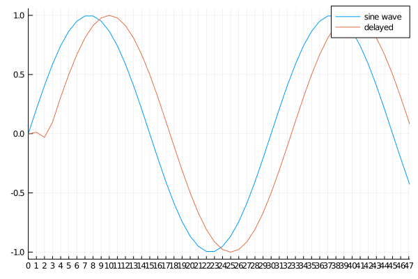

# FractionalDelayFilter.jl - A Julia package of a fractional delay filter using the Lagrange interpolation with modified Farrow structures


## Usage

Get a filter order corresponding to a delay that satisfies causal.  `maxorder` should be less than 10 because the accuracy of the filter will degrade due to the rounding error.

```
delay = 2.5
maxorder = 5
filterorder = filtord(delay, maxorder=maxorder)
```

Generate coefficients for a fractional delay filter defined by `filterorder` and `delay`.  `nonzeroindex` indicates the first index of the non-zero sample.

```
(fdfcoef, nonzeroindex) = getfdfcoef(filterorder, delay)
```

Generate a delayed sample of a sine wave as an example.  The output length is `length(input)+length(fdfcoef)-2+nonzeroindex`.  If `nonzeroindex` is greater than 0, zero-padding at the first `nonzeroindex` samples will be happen.

```
sinewave = sin.(0:π/(15):4π)
delayedwave = fdfilter(sinewave, fdfcoef, nonzeroindex)
```



There also are an in-place function `fdfilter!` and no zero-padding version `fdfilter`.

## Reference
This implementation is based on a book below.

- Välimäki, V., and T. I. Laakso. “Fractional Delay Filters—Design and Applications.” In Nonuniform Sampling, edited by Farokh Marvasti, 835–95. Information Technology: Transmission, Processing, and Storage. Boston, MA: Springer US, 2001. https://doi.org/10.1007/978-1-4615-1229-5_20.

